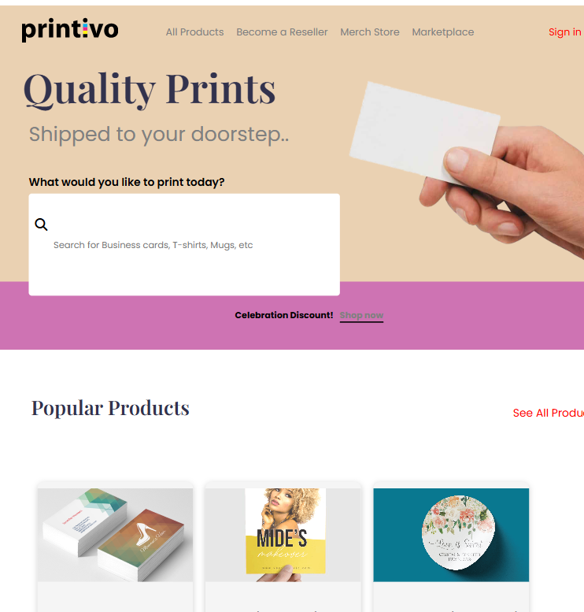

# Printivo Clone React Project

This is a solution to the Printivo Clone Project as directed by our Mentor— Superior. This project replicates the UI of the Printivo website using React and CSS.

- [Overview](#overview)
- [Screenshot](#screenshot)
- [Links](#links)
- [Technologies Used](#technologies-used)
- [Future Enhancement](#future-enhancement)
- [Credit](#credit)

## Overview

Users should be able to:

- View a well-structured clone of the Printivo website
- Navigate through various sections, including:
  - Navbar for site-wide navigation
  - Hero section with a search bar
  - Product section displaying different products
  - Individual product cards with pricing and images
  - Reseller/Affiliate signup section
  - Footer with additional links and information

### Screenshot

### Links

- [Live Site URL](https://rh-printivo-clone.netlify.app)

### Technologies Used

- React.js
- CSS3
- Google Fonts
- Font Awesome
- Vite (for project setup and development)

### Future Enhancement

- Improve interactivity with React state management
- Implement API calls for dynamic product rendering
- Optimize responsiveness for additional screen sizes

### Credit

- Author - Faithy Raymond
- Tutor - Superior, Web3Bridge

